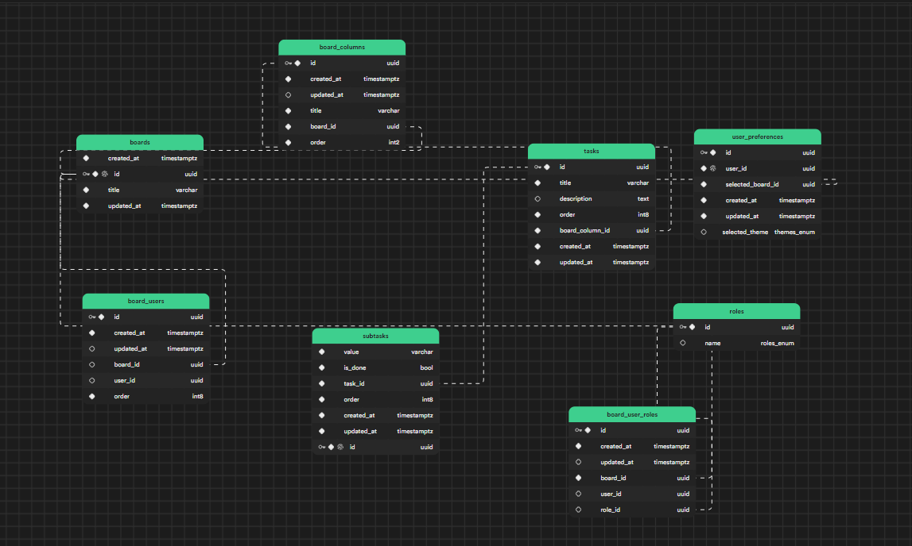

## Technologies used

- React (UI)
- Supbase (Backend)

## How UI

- Desktop first approach.
- Used styled components for styling the app and themeing and conditional styles are super easy to do with styled components.
- Used a custom hook (useData) for handling the state management and data fetching logic. Building this was hard but once it was ready it's super easy to handle the data fetching and state management with this hook.
- Used context for app wide state management.

## How Backend
- Used Supabase and SQL for storing the data

## learnings

- This app has 2 storage types for storing the users data one is local storage and supabase. To make it easier to work with I have implemented strategy pattern what it essentially does is that it seperates the data handling logic from the components. So the components will be clean
- Supabase (backend)
- Making the components resuable
- For animations use transform instead of position left, right ..etc for better perfomance.
- Designing the tables in SQL keeping normal forms in mind
- How to make a custom hook which takes care of data fetching and state management (useData)
- Using HOC pattern for abstracting the implementation of features like drag and drop using 3rd party library, this helps for easier updates in future if for some reason the 3rd party library is out of support.

## What would i do differently if i had to build this app again?
- Get rid of supabase and build an actual backend using node or .net, I thought it would make building this faster and simpler but it actually made it a lot harder since I had to learn how to use it and get used to it's syntax and also it does not support transactions so If I have to do 2 operations like updating the **tasks** and **subtasks** table we expect both the operations to fail if any one fails. Currently supabase does not support this transactions feature as of now.

